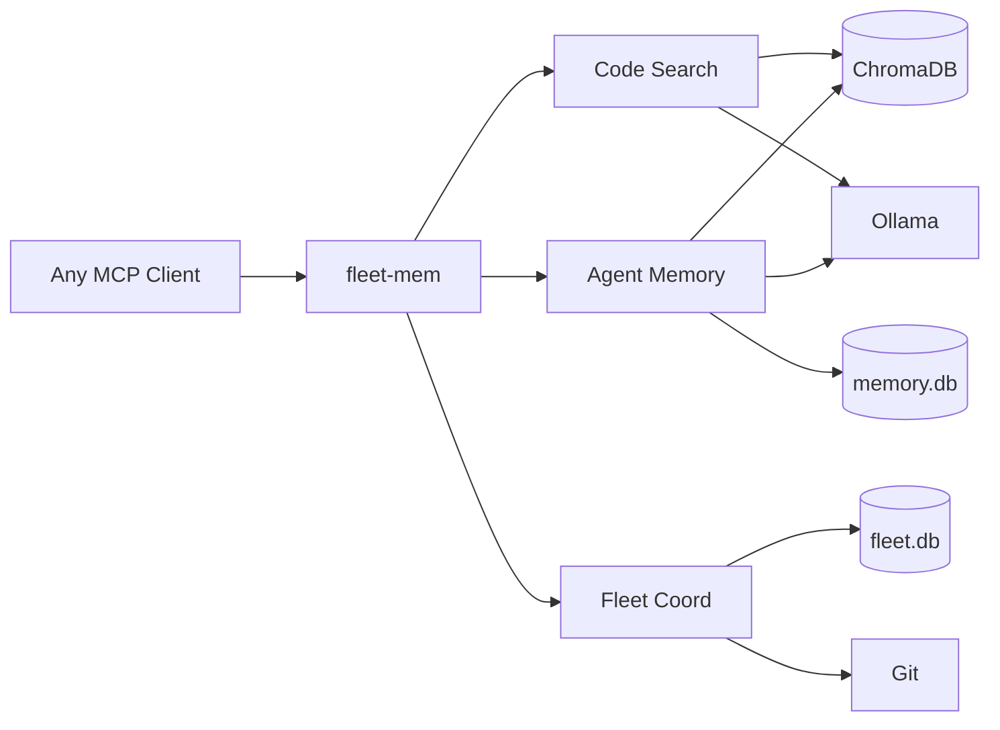
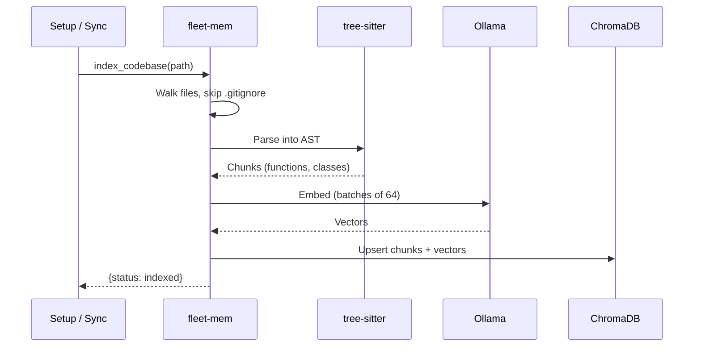
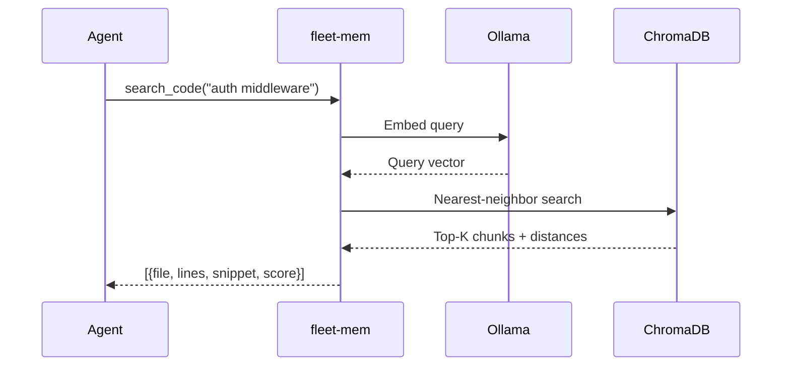
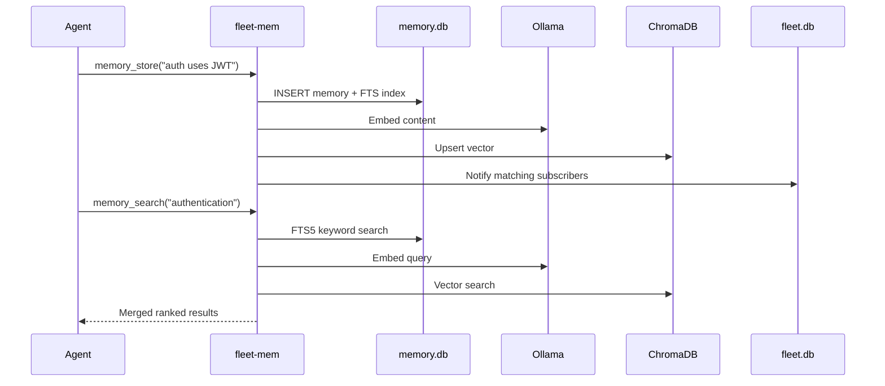
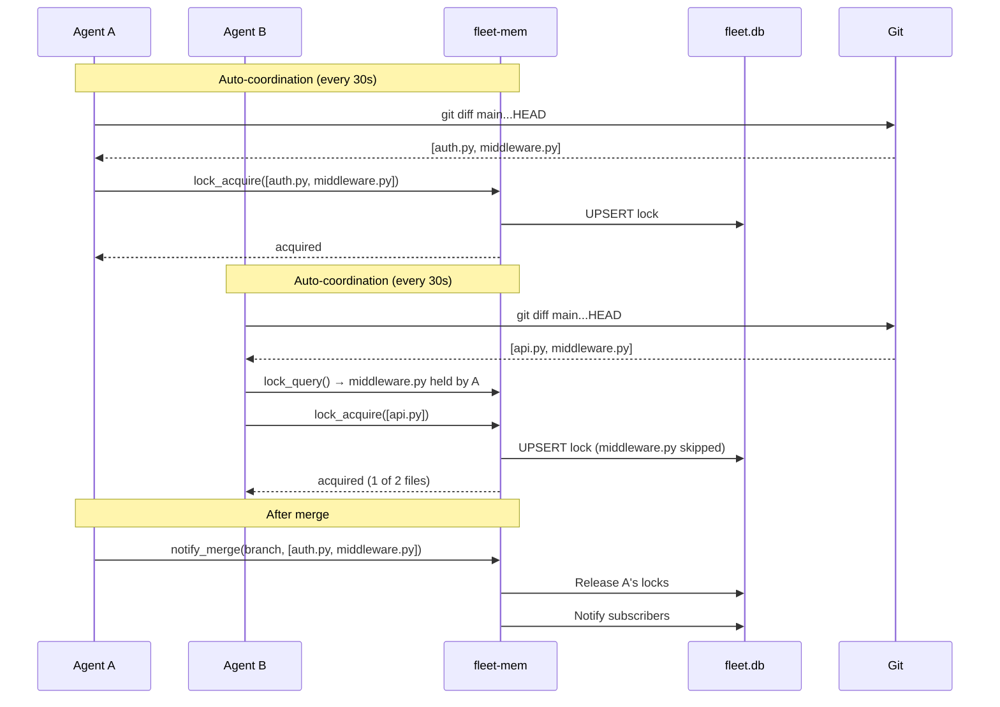
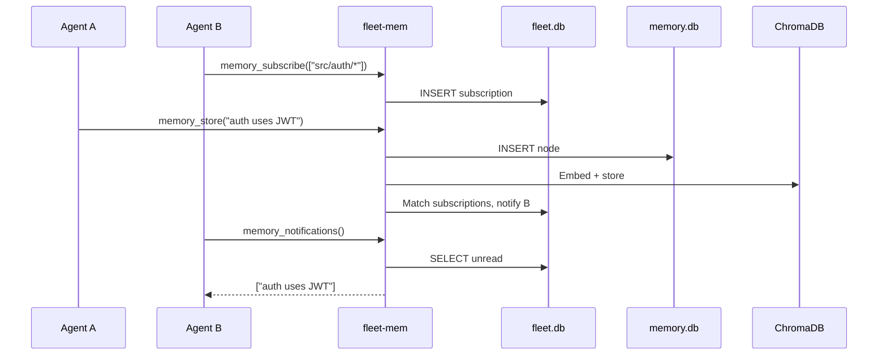
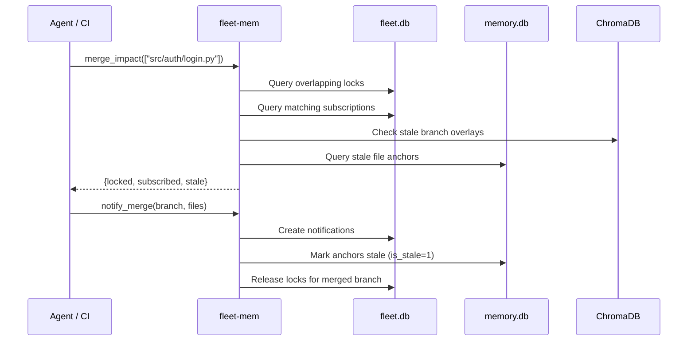
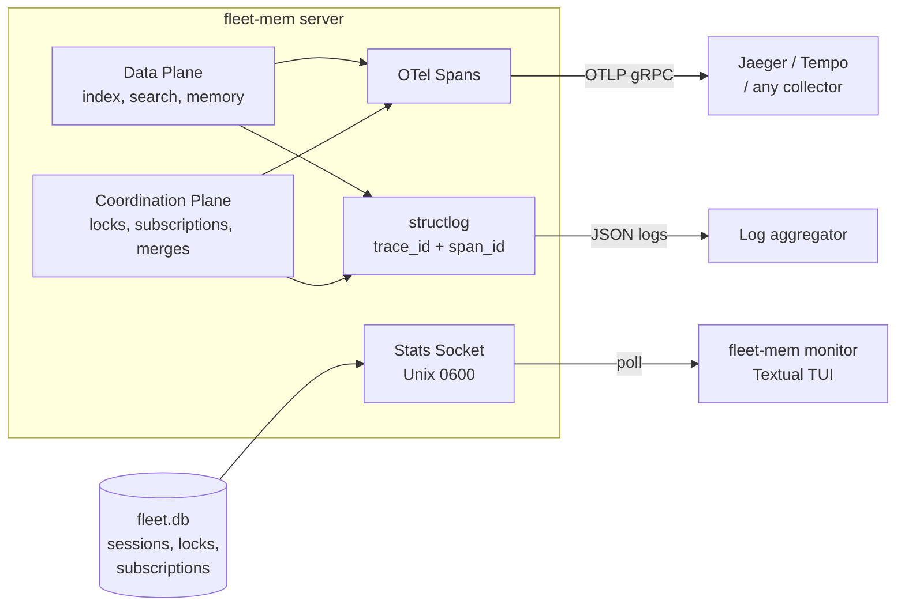
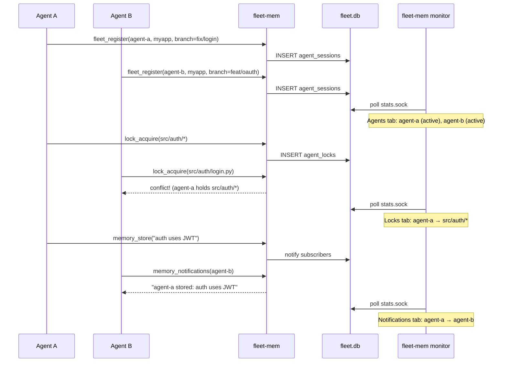

[](https://github.com/sam-ent/fleet-mem/actions/workflows/ci.yml)
[](https://www.gnu.org/licenses/agpl-3.0)
[](https://www.python.org/downloads/)
[](https://modelcontextprotocol.io)
[](https://pypi.org/project/fleet-mem/)

# fleet-mem

Shared code intelligence for agent fleets. AST-aware semantic search, multi-agent memory, and git-concurrent coordination.

**When multiple AI agents work on the same codebase, they fight.** Agent A rewrites a function that Agent B is also modifying. Agent C searches for a pattern that Agent D already found and documented. Agents repeat work, create conflicts, and operate on stale information.

fleet-mem is a local [MCP](https://modelcontextprotocol.io) server that gives AI coding agents shared context:

- **Zero data leakage by default.** Runs entirely on your machine using local Ollama embeddings. No cloud APIs, no telemetry, no data leaves your network. Cloud embedding providers (OpenAI, Gemini, etc.) are available as an opt-in choice.
- **Token-efficient code search.** Understands the structure of your code via Abstract Syntax Trees (AST). Returns the specific function, not the entire file.
- **Shared memory across agents.** Agent A discovers "this service uses JWT, not sessions." Agent B finds that knowledge automatically when working on the same code. Memories persist across sessions.
- **Fleet-aware coordination.** Agents declare what files they are working on, get blocked on conflicts before they start, and get notified when another agent's merge affects their context.

---

## Getting started

### Prerequisites

- Python 3.11+
- [Ollama](https://ollama.ai) running locally (brew, systemd, or Docker)
- `ollama pull nomic-embed-text`

<br>

### Install

```bash
pip install fleet-mem
```

Or from source:

```bash
git clone https://github.com/sam-ent/fleet-mem.git
cd fleet-mem
./scripts/setup.sh  # Creates venv, installs deps, registers MCP server
```

<br>

### Docker (alternative)

```bash
./scripts/docker-setup.sh
```

MCP client configuration for Docker:

```json
{
  "mcpServers": {
    "fleet-mem": {
      "command": "docker",
      "args": ["exec", "-i", "fleet-mem-fleet-mem-1", "python", "-m", "fleet_mem.server"]
    }
  }
}
```

Mount your code as a volume to index it:

```yaml
# Add to docker-compose.yml under fleet-mem.volumes:
- /path/to/your/projects:/projects:ro
```

<br>

### Index your codebases

```bash
./scripts/index-repos.sh --root ~/projects
```

<br>

### MCP client configuration

Add to your MCP client settings (the `setup.sh` script does this automatically for the default client):

```json
{
  "mcpServers": {
    "fleet-mem": {
      "command": "python3",
      "args": ["-m", "fleet_mem.server"],
      "env": {
        "OLLAMA_HOST": "http://localhost:11434",
        "ANONYMIZED_TELEMETRY": "False",
        "FLEET_STATS_SOCK": "~/.fleet-mem/stats.sock"
      }
    }
  }
}
```

> **Important:** Do not set `"cwd"` in the MCP config. Claude Code sets the working directory to the project the agent is working in. A hardcoded `cwd` breaks worktree detection and auto-coordination.

fleet-mem works with any MCP-compatible client. Your client starts it automatically on the first tool call.

<br>

### Example agent queries

Once indexed, agents can ask things they could not do with grep:

- *"Find the authentication middleware and show me how tokens are validated"*
- *"Which agent is currently working on the database schema?"*
- *"What did other agents learn about the payment gateway this session?"*
- *"If I merge this branch, which agents will have stale context?"*

---

## How it works

fleet-mem installs once as a global MCP server. It can index any number of projects. Each project gets its own collection in ChromaDB. All agents share the same server instance.

```
~/projects/
  project-a/     indexed as code_project-a
  project-b/     indexed as code_project-b
  project-c/     indexed as code_project-c

~/.local/share/fleet-mem/
  chroma/              vector embeddings (shared)
  memory.db            agent memories + FTS + file anchors (WAL mode)
  fleet.db             locks, subscriptions, sessions, notifications (WAL mode)
  embeddings_cache.db  embedding vector cache
```

<br>

### Architecture



<br>

### Components

| Component | What it is | Why we chose it |
|-----------|-----------|-----------------|
| **[Ollama](https://ollama.ai)** | Local ML inference server | Runs embedding models on your machine at zero cost. Supports dozens of models. Works via Docker, systemd, or brew. Swappable via the `Embedding` base class |
| **[ChromaDB](https://www.trychroma.com/)** | Vector database (HNSW) | Purpose-built for similarity search over embeddings. Runs in-process, no separate server needed |
| **SQLite + FTS5** | Relational database with full-text search | Agent memories need both keyword search and structured queries. FTS5 + ChromaDB vectors give hybrid ranking via reciprocal rank fusion |
| **[tree-sitter](https://tree-sitter.github.io/tree-sitter/)** | Incremental parsing library | Splits code into semantic chunks (functions, classes, methods) instead of arbitrary character windows. Search results are meaningful code units, not fragments |
| **[xxHash](https://xxhash.com) (xxh3_64)** | File change detection + chunk IDs | Detects which files changed between sync cycles. Not a security function, purely for diffing. ~10x faster than SHA-1 |

<br>

### Language support

| Language | Splitting method | Support level |
|----------|-----------------|---------------|
| Python, TypeScript, JavaScript | AST-aware | Tier 1: functions, classes, methods |
| Go | AST-aware | Tier 2: functions, methods, types |
| Rust | AST-aware | Tier 2: functions, impl blocks, structs, enums, traits |
| All other languages | Text-only | Fallback: sliding window (2500 chars, 300 overlap) |

AST-aware splitting means search results are complete, meaningful code units. Text-only fallback still works but may return partial functions. Adding a new language requires defining its tree-sitter node types in `fleet_mem/splitter/ast_splitter.py` (contributions welcome).

<br>

### Process flows

<br>

#### Indexing a codebase

> **<ins>Problem</ins>:** Agents read entire files to understand code, burning tokens and missing context across files.
>
> **<ins>Solution</ins>:** One-time indexing parses code into semantic chunks and embeds them. Agents search by meaning across the whole codebase.



<br>

#### Semantic code search

> **<ins>Problem</ins>:** Grep requires exact strings. Agents don't know file names or function signatures in unfamiliar code.
>
> **<ins>Solution</ins>:** Natural language query returns ranked code snippets with file paths and line numbers. No exact match needed.



<br>

#### Storing and searching memory

> **<ins>Problem</ins>:** Agents lose everything they learn when a session ends. The next agent re-discovers the same things from scratch.
>
> **<ins>Solution</ins>:** Discoveries persist in a shared memory store. Any agent can find them later via keyword or semantic search.



<br>

#### File locking

> **<ins>Problem</ins>:** Concurrent agents modify the same files, causing merge conflicts and wasted work.
>
> **<ins>Solution</ins>:** Agents automatically lock files they've modified on their branch. Conflicts are caught immediately, not after hours of wasted effort. If some files overlap with another agent's lock, only the non-conflicting files are locked.



<br>

#### Cross-agent knowledge sharing

> **<ins>Problem</ins>:** Agent A discovers something important about the code. Agent B, working in the same area, has no way to know.
>
> **<ins>Solution</ins>:** Agents subscribe to file patterns they care about. When another agent stores a discovery matching that pattern, subscribers are notified automatically.



<br>

#### Merge impact preview

> **<ins>Problem</ins>:** Agent A merges a PR. Agents B and C are still working on branches that now have stale context. No one tells them.
>
> **<ins>Solution</ins>:** Before merging, see exactly which agents, memories, and branches will be affected. After merging, one call notifies everyone and marks stale context.



<br>

### Embedding providers

The default is Ollama (local, free). fleet-mem also ships an OpenAI-compatible adapter that works with any provider offering an OpenAI-style embeddings API.

| Provider | Setup | Cost |
|----------|-------|------|
| **Ollama** (default) | Install Ollama, `ollama pull nomic-embed-text` | Free |
| **OpenAI** | Set `EMBEDDING_PROVIDER=openai-compat`, `EMBED_API_KEY`, `EMBED_MODEL=text-embedding-3-small` | ~$0.02/1M tokens |
| **DeepSeek** | Set `EMBED_BASE_URL=https://api.deepseek.com/v1`, `EMBED_API_KEY`, `EMBED_MODEL=deepseek-embed` | ~$0.01/1M tokens |
| **Gemini** | Set `EMBED_BASE_URL=https://generativelanguage.googleapis.com/v1beta/openai/`, `EMBED_API_KEY`, `EMBED_MODEL=text-embedding-004` | Free tier available |
| **Together** | Set `EMBED_BASE_URL=https://api.together.xyz/v1`, `EMBED_API_KEY`, model of choice | Varies |
| **Local vLLM** | Set `EMBED_BASE_URL=http://localhost:8000/v1`, no API key needed | Free |

See `.env.example` for full configuration. For providers without an OpenAI-compatible API (Cohere, AWS Bedrock, Hugging Face), see [docs/custom-embedding-providers.md](docs/custom-embedding-providers.md). The adapter interface is four methods and typically under 30 lines.

---

## Features

### Code understanding

- **Semantic search**: "find auth middleware" returns relevant functions, not string matches
- **Symbol lookup**: find function/class definitions across indexed projects
- **Dependency analysis**: trace what calls or imports a given symbol
- **Incremental sync**: xxHash Merkle tree detects file changes, re-indexes only deltas
- **Branch-aware indexing**: overlay collections for feature branches keep changes isolated from the main index

<br>

### Fleet coordination

- **Auto-coordination**: on startup and every 30s, agents automatically lock and subscribe to files modified on their branch vs main. No manual `lock_acquire` or `memory_subscribe` calls needed
- **Per-file lock filtering**: if some files overlap with another agent's lock, only the non-conflicting files are locked (not all-or-nothing)
- **Worktree-aware**: agents in different git worktrees of the same repo share a single project namespace. Uses `git rev-parse --git-common-dir` with `--show-toplevel` fallback
- **UPSERT locks**: one lock per agent per project, atomically updated via `INSERT...ON CONFLICT DO UPDATE`. No duplicate accumulation across restarts
- **Cross-agent memory**: agents share discoveries via subscriptions and notifications. `memory_store` automatically notifies subscribers matching the file path
- **Merge impact preview**: before merging, see which in-flight agents would be affected
- **Post-merge notification**: after merging, automatically notify affected agents, mark stale file anchors, and release locks on the merged branch
- **WAL mode + busy timeout**: all fleet DB modules use SQLite WAL mode with 5s busy timeout for concurrent multi-agent access

---

## Configuration

All settings via environment variables or a `.env` file in the project root. Copy `.env.example` to get started.

| Variable | Default | Description |
|----------|---------|-------------|
| `OLLAMA_HOST` | `http://localhost:11434` | Ollama API endpoint |
| `OLLAMA_EMBED_MODEL` | `nomic-embed-text` | Embedding model name |
| `EMBEDDING_PROVIDER` | `ollama` | Provider: `ollama` or `openai-compat` |
| `CHROMA_PATH` | `~/.local/share/fleet-mem/chroma` | ChromaDB storage |
| `MEMORY_DB_PATH` | `~/.local/share/fleet-mem/memory.db` | Agent memory database |
| `FLEET_DB_PATH` | `~/.local/share/fleet-mem/fleet.db` | Fleet coordination database |
| `SYNC_INTERVAL` | `300` | Background code index sync (seconds) |
| `FILE_WATCHING` | `true` | Enable filesystem watching for near-instant sync |

<br>

### Background sync timing

| What | Timing | How |
|------|--------|-----|
| **Code index refresh** | Every `SYNC_INTERVAL` seconds (default: 300) | Polls filesystem, computes xxHash digests, re-indexes changed files |
| **Agent memory writes** | Immediate | Direct SQLite + ChromaDB insert on `memory_store` call |
| **Lock acquire/release** | Immediate | Direct SQLite UPSERT (one lock per agent per project) |
| **Auto-coordination** | Every 30s (heartbeat) | Detects new commits via `git diff main...HEAD`, locks + subscribes to changed files |
| **Notifications** | Immediate | Created on `memory_store` if subscriptions match (scoped by project) |
| **Session heartbeat** | Every 30s | Updates `last_activity_at`, extends lock TTLs |
| **Stale session pruning** | On query | Sessions disconnected >24h are auto-deleted |

For fast-moving multi-agent work, reduce `SYNC_INTERVAL` to `30`-`60`. File-watching is also available for near-instant sync — set `FILE_WATCHING=true` (the default) to detect changes immediately without polling.

<br>

### Scripts

| Script | Purpose |
|--------|---------|
| `scripts/setup.sh` | One-time install: venv, dependencies, Ollama check, MCP registration |
| `scripts/index-repos.sh` | Find git repos under a root directory and index each one |
| `scripts/import-flat-files.py` | Import existing memory files (markdown with YAML frontmatter) |
| `scripts/embed-existing-nodes.py` | Embed existing memory DB nodes into ChromaDB for semantic search |

---

## Observability

fleet-mem includes OpenTelemetry tracing, structured logging with trace correlation, and a terminal monitoring UI. All disabled by default.

#### Observability architecture



#### Monitoring a fleet

> **<ins>Problem</ins>:** Multiple agents are working on the same codebase. You can't tell which agents are active, what files they've locked, or whether they're conflicting — until something breaks.
>
> **<ins>Solution</ins>:** Agents register on connect. The TUI monitor polls fleet state over a Unix socket and shows agents, locks, subscriptions, and notifications in real time.



### Quick start — Fleet monitor TUI

No external infrastructure needed. Install the monitor extra, set one env var, and go:

```bash
# 1. Install with monitor
pip install fleet-mem[monitor]

# 2. Enable the stats socket (add to your .env or MCP server config)
FLEET_STATS_SOCK=~/.fleet-mem/stats.sock

# 3. Launch the monitor in a separate terminal
fleet-mem monitor
```

The TUI connects via a Unix domain socket (0600 permissions — only the socket owner can connect, no network exposure). It shows:

- **Dashboard tab**: Aggregate metrics with sparklines, conflict alerts (red banner when agents have overlapping locks), and gauges for active agents/locks/notifications/memory
- **Agents tab**: Registered agents with project, worktree, branch, and color-coded rows (green=active+locked, white=active, dim=disconnected). Disconnected agents hidden by default — press `d` to toggle
- **Locks tab**: Active file locks with per-file conflict visualization showing which files are contested between which agents
- **Subscriptions tab**: Tree view grouped by agent (collapsible — `agent-alpha (30 files) → expand`), not a flat table of 800+ rows
- **Memory tab**: Memory node counts, file anchors, embedding cache, and collection stats
- **Notifications tab**: Cross-agent notifications with read/unread styling
- **Log tab**: Live event log showing auto-coordination events, prune actions, and toggle state changes

**Keybindings:** `q` quit, `r` refresh, `f` filter by agent ID, `d` toggle disconnected agents, `x` prune disconnected sessions from DB

For Docker deployments, the socket is exposed via a named volume (`fleet-sock`). Mount it on the host to run the monitor:

```bash
docker compose up -d
fleet-mem monitor --sock /var/lib/docker/volumes/fleet-mem_fleet-sock/_data/stats.sock
```

### Advanced — OpenTelemetry tracing

For teams with existing observability infrastructure (Jaeger, Grafana Tempo, Datadog), fleet-mem exports OpenTelemetry spans:

```bash
OTEL_ENABLED=true
OTEL_EXPORTER_OTLP_ENDPOINT=http://localhost:4317  # any OTLP-compatible collector
```

**Data plane spans:**

| Span | Key attributes |
|------|---------------|
| `fleet.index` | project, chunk_count |
| `fleet.search` | query_hash (never raw query), result_count, cache_hits |
| `fleet.memory.store` | content_hash, node_type |
| `fleet.memory.search` | query_hash, result_count |

**Coordination plane spans:**

| Span | Key attributes |
|------|---------------|
| `fleet.lock.acquire` | agent_id, project, conflict_count, lock_id |
| `fleet.lock.release` | agent_id, project, released_count |
| `fleet.lock.query` | project, lock_count |
| `fleet.lock.heartbeat` | agent_id, extended_count |
| `fleet.memory.feed` | agent_id, since_minutes, result_count |
| `fleet.memory.subscribe` | agent_id, project, subscription_count |
| `fleet.memory.notifications` | agent_id, notification_count |
| `fleet.memory.notify_subscribers` | author_agent_id, subscriber_count, notification_count |
| `fleet.merge.impact` | project, file_count, conflict_count, subscriber_count |
| `fleet.merge.notify` | project, branch, notification_count, stale_anchor_count |

All content is hashed in span attributes for privacy. Raw code and queries never appear in traces.

### Structured logging

fleet-mem uses [structlog](https://www.structlog.org/) with OpenTelemetry trace context injection. When a span is active, `trace_id` and `span_id` are automatically added to every log line — enabling log-to-trace correlation in Grafana, Datadog, or any log aggregator.

- **OTEL_ENABLED=true**: JSON output (machine-parseable, for log pipelines)
- **OTEL_ENABLED=false** (default): Human-readable console output

### Fleet stats (no collector needed)

The `fleet_stats` MCP tool returns current metrics without requiring an external collector:

```
fleet_stats() -> {
  collections: {code_myproject: 1523},
  total_chunks: 1523,
  memory_nodes: 47,
  active_locks: 2,
  subscriptions: 5,
  pending_notifications: 1,
  cached_embeddings: 892
}
```

---

## MCP tools reference

### Code search (6 tools)

| Tool | Parameters | Description |
|------|-----------|-------------|
| `index_codebase` | `path, branch?, force?` | Index a codebase (background). Branch-aware when `branch` specified |
| `search_code` | `query, path?, branch?, limit?` | Semantic code search across indexed projects |
| `find_symbol` | `name, file_path?, symbol_type?` | Find symbol definitions (functions, classes) |
| `find_similar_code` | `code_snippet, limit?` | Find code similar to a given snippet |
| `get_change_impact` | `file_paths?, symbol_names?` | Find code affected by changes to given files/symbols |
| `get_dependents` | `symbol_name, depth?` | Trace what calls/imports a symbol (BFS) |

<br>

### Agent memory (4 tools)

| Tool | Parameters | Description |
|------|-----------|-------------|
| `memory_store` | `node_type, content, summary?, keywords?, file_path?, line_range?, source?, project_path?` | Store a memory with optional file anchor |
| `memory_search` | `query, top_k?, node_type?` | Hybrid keyword + semantic memory search |
| `memory_promote` | `memory_id, target_scope?` | Promote a project memory to global scope |
| `stale_check` | `project_path?` | Find memories whose anchored files have changed |

<br>

### Fleet coordination (10 tools)

| Tool | Parameters | Description |
|------|-----------|-------------|
| `fleet_register` | `agent_id, project, worktree_path?, branch?` | Register an agent session (call once when starting work) |
| `fleet_agents` | | List all registered agents with status (active/idle/disconnected) |
| `lock_acquire` | `agent_id, project, file_patterns` | Declare files an agent is working on |
| `lock_release` | `agent_id, project` | Release file locks |
| `lock_query` | `project, file_path?` | Check who holds locks on which files |
| `merge_impact` | `project, files` | Preview which agents/memories are affected by a merge |
| `notify_merge` | `project, branch, merged_files` | Post-merge: notify affected agents, mark stale anchors |
| `memory_feed` | `agent_id?, since_minutes?` | Recent memories from other agents |
| `memory_subscribe` | `agent_id, file_patterns` | Subscribe to memories about specific files |
| `memory_notifications` | `agent_id` | Check for new relevant memories from other agents |

<br>

### Status and observability (7 tools)

| Tool | Parameters | Description |
|------|-----------|-------------|
| `get_index_status` | `path` | Check indexing status for a project |
| `clear_index` | `path` | Drop a project's index and reset |
| `get_branches` | `path` | List indexed branches with chunk counts |
| `cleanup_branch` | `path, branch` | Drop a branch overlay after merge |
| `fleet_stats` | | Current metrics: chunks, memories, locks, cache hits, notifications |
| `reconcile` | `path` | Remove ghost chunks whose source files no longer exist |
| `clear_embedding_cache` | | Clear the embedding vector cache, forcing re-embedding on next use |

---

## What's next

- [ ] Go/Rust recursive AST splitting (promote to Tier 1)
- [ ] Performance benchmarks on real codebases
- [ ] MCP client configuration guides for Cursor, Windsurf
- [ ] OTel Metrics API (histograms/counters for coordination)
- [ ] Grafana dashboard JSON for coordination observability

See [roadmap.md](roadmap.md) for the full plan.

---

## License

AGPL-3.0

<details>
<summary>Acknowledgments</summary>

Architecture inspired by [claude-context](https://github.com/zilliztech/claude-context) by Zilliz (MIT License). Design patterns informed by their TypeScript reference (vector database abstraction, embedding adapter, Merkle DAG, AST splitter). All code is an original Python implementation with significant additions (agent memory, fleet coordination, hybrid search, staleness detection).
</details>
