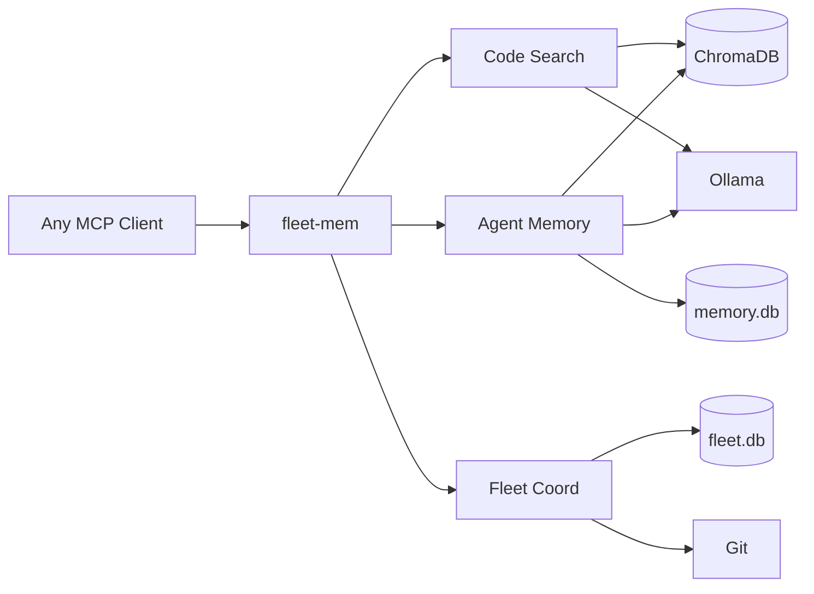
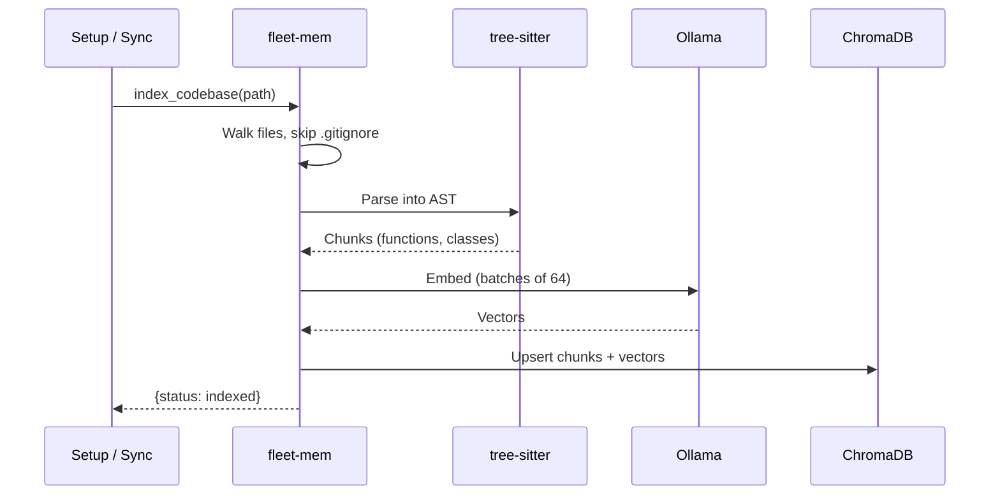
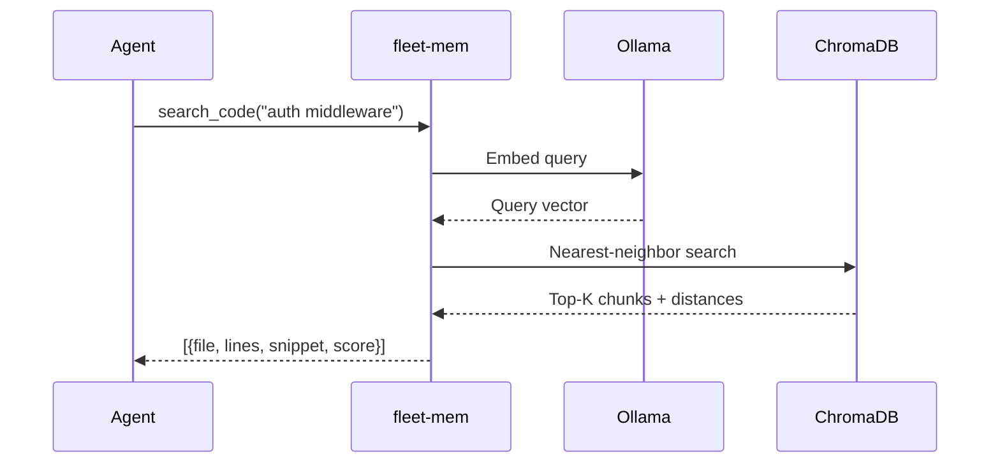
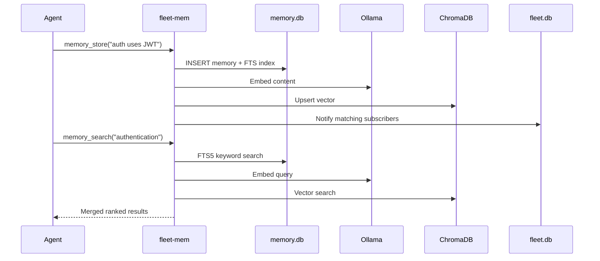
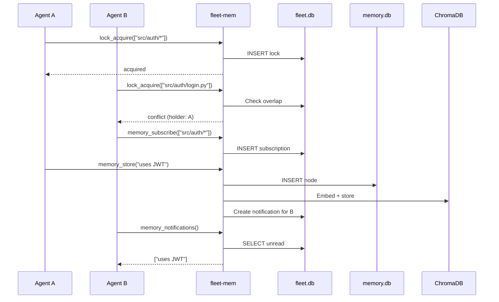
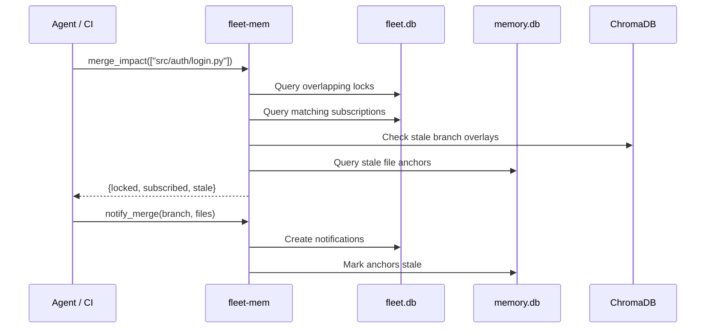

[](https://github.com/sam-ent/fleet-mem/actions/workflows/ci.yml)
[](https://opensource.org/licenses/MIT)
[](https://www.python.org/downloads/)
[](https://modelcontextprotocol.io)

# fleet-mem

**When multiple AI agents work on the same codebase, they need shared context.** Without it, Agent A rewrites a function that Agent B is also modifying. Agent C searches for a pattern that Agent D already found and documented. Agents repeat work, create conflicts, and operate on stale information.

fleet-mem solves this. It is a local [MCP](https://modelcontextprotocol.io) server that gives AI coding agents two things:

1. **Code understanding** with minimal token cost: parse codebases into semantic chunks using Abstract Syntax Trees (AST), embed them locally, and search by meaning rather than keywords
2. **Fleet coordination**: share discoveries across agents, prevent file conflicts with a lock registry, and detect stale context when another agent merges changes

It runs entirely on your machine. No cloud APIs, no telemetry, no data leaves your network.

## How it works

fleet-mem installs once as a global MCP server. It can index any number of projects. Each project gets its own collection in ChromaDB. All agents share the same server instance.

```
~/projects/
  ├── project-a/   <-- indexed as code_project-a
  ├── project-b/   <-- indexed as code_project-b
  └── project-c/   <-- indexed as code_project-c

~/.local/share/fleet-mem/
  ├── chroma/      <-- all vector embeddings (shared)
  ├── memory.db    <-- agent memories (shared)
  └── fleet.db     <-- locks, subscriptions (shared)
```

### Architecture



### Why these components?

| Component | What it is | Why we chose it |
|-----------|-----------|-----------------|
| **[Ollama](https://ollama.ai)** | Local inference server for ML models | Runs embedding models on your machine with zero API costs. Supports dozens of models. Works via Docker, systemd, or brew. If you prefer a different provider, the `Embedding` base class is swappable |
| **[ChromaDB](https://www.trychroma.com/)** | Vector database with HNSW indexing | Purpose-built for similarity search over embeddings. SQLite can't do vector nearest-neighbor efficiently. Runs in-process (no separate server) |
| **SQLite + FTS5** | Relational database with full-text search | Agent memories need both keyword search ("find all memories about auth") and structured queries (file anchors, staleness). FTS5 + ChromaDB vectors give hybrid ranking via reciprocal rank fusion |
| **[tree-sitter](https://tree-sitter.github.io/tree-sitter/)** | Incremental parsing library | Splits code into semantic chunks (functions, classes, methods) instead of arbitrary character windows. This means search results are meaningful code units, not fragments. Supports 15+ languages |
| **[xxHash](https://xxhash.com) (xxh3_64)** | File change detection (Merkle tree) and chunk ID generation | Used to detect which files changed between sync cycles and to generate deterministic chunk document IDs. This is **not a security function** -- it is purely for diffing and identification. xxh3_64 is significantly faster than SHA-1 while providing excellent hash distribution |

### Embedding providers

The default is Ollama (local, free). fleet-mem also ships an OpenAI-compatible adapter that works with any provider offering an OpenAI-style embeddings API.

| Provider | Setup | Cost |
|----------|-------|------|
| **Ollama** (default) | Install Ollama, `ollama pull nomic-embed-text` | Free |
| **OpenAI** | Set `EMBEDDING_PROVIDER=openai-compat`, `EMBED_API_KEY`, `EMBED_MODEL=text-embedding-3-small` | ~$0.02/1M tokens |
| **DeepSeek** | Set `EMBED_BASE_URL=https://api.deepseek.com/v1`, `EMBED_API_KEY`, `EMBED_MODEL=deepseek-embed` | ~$0.01/1M tokens |
| **Together** | Set `EMBED_BASE_URL=https://api.together.xyz/v1`, `EMBED_API_KEY`, model of choice | Varies |
| **Fireworks** | Set `EMBED_BASE_URL=https://api.fireworks.ai/inference/v1`, `EMBED_API_KEY`, model of choice | Varies |
| **Local vLLM** | Set `EMBED_BASE_URL=http://localhost:8000/v1`, no API key needed | Free |

See `.env.example` for full configuration details.

**Gemini:** Google offers an [OpenAI-compatible endpoint](https://ai.google.dev/gemini-api/docs/openai). Set `EMBED_BASE_URL=https://generativelanguage.googleapis.com/v1beta/openai/`, `EMBED_API_KEY` to your Gemini API key, and `EMBED_MODEL=text-embedding-004`.

**Cohere:** Cohere does not offer an OpenAI-compatible API. To use Cohere embeddings, create a custom adapter by subclassing `src/embedding/base.py`:

```python
# src/embedding/cohere_embed.py
import cohere
from src.embedding.base import Embedding

class CohereEmbedding(Embedding):
    def __init__(self, api_key: str, model: str = "embed-english-v3.0"):
        self._client = cohere.Client(api_key)
        self._model = model
        self._dimension = None

    def embed(self, text: str) -> list[float]:
        r = self._client.embed(texts=[text], model=self._model, input_type="search_document")
        self._dimension = len(r.embeddings[0])
        return r.embeddings[0]

    def embed_batch(self, texts: list[str]) -> list[list[float]]:
        r = self._client.embed(texts=texts, model=self._model, input_type="search_document")
        if self._dimension is None:
            self._dimension = len(r.embeddings[0])
        return r.embeddings

    def get_dimension(self) -> int:
        if self._dimension is None:
            self.embed("probe")
        return self._dimension

    def get_provider(self) -> str:
        return f"cohere/{self._model}"
```

Then set `EMBEDDING_PROVIDER=cohere` and add routing logic in `src/server.py`'s `_get_embedder()` function.

**Other providers (AWS Bedrock, Hugging Face, etc.):** See [docs/custom-embedding-providers.md](docs/custom-embedding-providers.md) for a step-by-step guide to creating your own adapter. The interface is four methods and typically under 30 lines of code.

### Indexing a codebase

*Agents search code by meaning, not grep. One-time indexing turns your codebase into a searchable vector space where "find auth middleware" returns the actual functions, not string matches.*



### Semantic code search

*Agents find relevant code without knowing exact names or file locations. A natural language query returns ranked code snippets with file paths and line numbers, saving tokens by not reading entire files.*



### Storing and searching memory

*Agents remember what they learn across sessions. When Agent A discovers "this service uses JWT, not sessions," that knowledge persists and is findable by any agent later, through both keyword and semantic search.*



### Multi-agent coordination

*Without coordination, concurrent agents create merge conflicts and duplicate work. This flow prevents that: agents declare what files they are touching, get blocked if another agent is already there, and automatically receive discoveries relevant to their work area.*



### Merge impact preview

*Before merging, you can see exactly which in-flight agents will be affected, which memories will go stale, and who needs to be notified. After merging, one call updates everyone. No more "Agent B was working on stale code for 30 minutes because Agent A merged without telling anyone."*



## Features

### Code understanding

- **Semantic search**: "find auth middleware" returns relevant functions, not just string matches
- **Symbol lookup**: find function/class definitions across indexed projects
- **Dependency analysis**: trace what calls or imports a given symbol
- **Incremental sync**: xxHash Merkle tree detects file changes, re-indexes only deltas
- **Branch-aware indexing**: overlay collections for feature branches keep branch-specific changes isolated from the main index

### Fleet coordination

- **File lock registry**: agents declare which files they are working on, others check before starting
- **Cross-agent memory**: agents share discoveries via subscriptions and notifications
- **Merge impact preview**: before merging, see which in-flight agents would be affected
- **Post-merge notification**: after merging, automatically notify affected agents and mark stale context

## Getting started

### Prerequisites

- Python 3.11+
- [Ollama](https://ollama.ai) running locally (any install method: brew, systemd, Docker)
- The `nomic-embed-text` model pulled: `ollama pull nomic-embed-text`

### Setup

```bash
git clone https://github.com/sam-ent/fleet-mem.git
cd fleet-mem

# Install: creates venv, installs deps, registers MCP server
./scripts/setup.sh

# Index your codebases (searches for git repos under the given root)
./scripts/index-repos.sh --root ~/projects
```

fleet-mem registers itself as a global MCP server. Your MCP client starts it automatically on first tool call. No per-project setup needed.

### Scripts

| Script | Purpose |
|--------|---------|
| `scripts/setup.sh` | One-time install: venv, dependencies, Ollama check, MCP registration |
| `scripts/index-repos.sh` | Find git repos under a root directory and index each one |
| `scripts/import-flat-files.py` | Import existing memory files (markdown with YAML frontmatter) |
| `scripts/embed-existing-nodes.py` | Embed existing memory DB nodes into ChromaDB for semantic search |

## Configuration

All settings via environment variables or a `.env` file in the project root. Copy `.env.example` to get started.

| Variable | Default | Description |
|----------|---------|-------------|
| `OLLAMA_HOST` | `http://localhost:11434` | Ollama API endpoint. Standard port for all install methods |
| `OLLAMA_EMBED_MODEL` | `nomic-embed-text` | Embedding model name. Any Ollama-compatible model works |
| `CHROMA_PATH` | `~/.local/share/fleet-mem/chroma` | ChromaDB persistent storage |
| `MEMORY_DB_PATH` | `~/.local/share/fleet-mem/memory.db` | Agent memory database |
| `FLEET_DB_PATH` | `~/.local/share/fleet-mem/fleet.db` | Fleet coordination database (locks, subscriptions) |
| `SYNC_INTERVAL` | `300` | Background code index sync interval in seconds (see below) |
| `MCP_SETTINGS_FILE` | `~/.claude/settings.json` | MCP client settings file. Override for non-default clients |

### Background sync timing

| What | Timing | How |
|------|--------|-----|
| **Code index refresh** | Every `SYNC_INTERVAL` seconds (default: 300) | Polls filesystem, computes xxHash digests, re-indexes changed files |
| **Agent memory writes** | Immediate | Direct SQLite + ChromaDB insert on `memory_store` call |
| **Lock acquire/release** | Immediate | Direct SQLite write |
| **Notifications** | Immediate | Created on `memory_store` if subscriptions match |

For fast-moving multi-agent work, reduce `SYNC_INTERVAL` to `30`-`60`. The poll walks the filesystem and hashes files, so very low intervals (under 10s) may use noticeable CPU on large repos. A future release will add file-watching for near-instant sync.

## MCP tools reference

### Code search (6 tools)

| Tool | Parameters | Description |
|------|-----------|-------------|
| `index_codebase` | `path, branch?, force?` | Index a codebase (background). Branch-aware when `branch` specified |
| `search_code` | `query, path?, branch?, limit?` | Semantic code search across indexed projects |
| `find_symbol` | `name, file_path?, symbol_type?` | Find symbol definitions (functions, classes) |
| `find_similar_code` | `code_snippet, limit?` | Find code similar to a given snippet |
| `get_change_impact` | `file_paths?, symbol_names?` | Find code affected by changes to given files/symbols |
| `get_dependents` | `symbol_name, depth?` | Trace what calls/imports a symbol (BFS) |

### Agent memory (4 tools)

| Tool | Parameters | Description |
|------|-----------|-------------|
| `memory_store` | `node_type, content, agent_id?` | Store a memory with optional file anchor |
| `memory_search` | `query, top_k?, node_type?` | Hybrid keyword + semantic memory search |
| `memory_promote` | `memory_id, target_scope?` | Promote a project memory to global scope |
| `stale_check` | `project_path?` | Find memories whose anchored files have changed |

### Fleet coordination (8 tools)

| Tool | Parameters | Description |
|------|-----------|-------------|
| `lock_acquire` | `agent_id, project, file_patterns` | Declare files an agent is working on |
| `lock_release` | `agent_id, project` | Release file locks |
| `lock_query` | `project, file_path?` | Check who holds locks on which files |
| `merge_impact` | `project, files` | Preview which agents/memories are affected by a merge |
| `notify_merge` | `project, branch, merged_files` | Post-merge: notify affected agents, mark stale anchors |
| `memory_feed` | `agent_id?, since_minutes?` | Recent memories from other agents |
| `memory_subscribe` | `agent_id, file_patterns` | Subscribe to memories about specific files |
| `memory_notifications` | `agent_id` | Check for new relevant memories from other agents |

### Status (4 tools)

| Tool | Parameters | Description |
|------|-----------|-------------|
| `get_index_status` | `path` | Check indexing status for a project |
| `clear_index` | `path` | Drop a project's index and reset |
| `get_branches` | `path` | List indexed branches with chunk counts |
| `cleanup_branch` | `path, branch` | Drop a branch overlay after merge |

## Acknowledgments

Architecture inspired by [claude-context](https://github.com/zilliztech/claude-context) by Zilliz (MIT License). The following design patterns were informed by their TypeScript reference:

- Vector database abstraction with collection-based storage
- Embedding adapter with auto-dimension detection and batch chunking
- Merkle DAG for file change detection with snapshot comparison
- File synchronizer with JSON snapshot persistence
- AST splitter with per-language tree-sitter node-type tables

All code is an original Python implementation with significant additions (agent memory, fleet coordination, hybrid search, staleness detection).

## License

MIT
