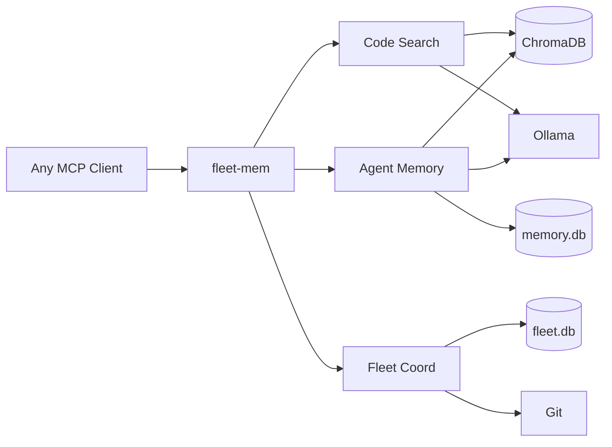
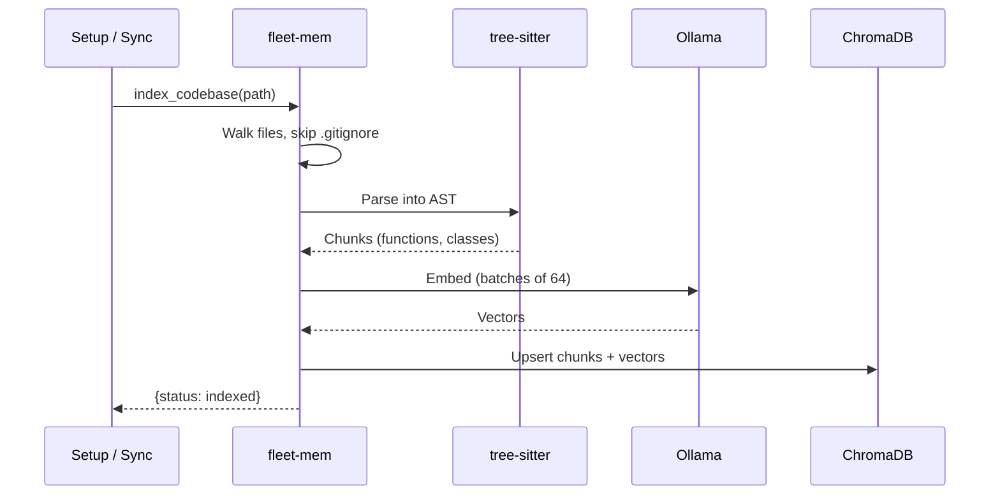
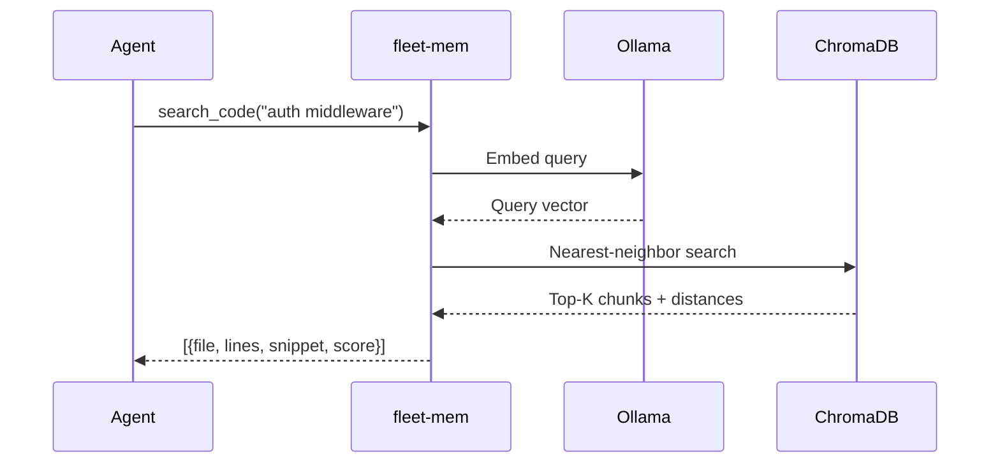
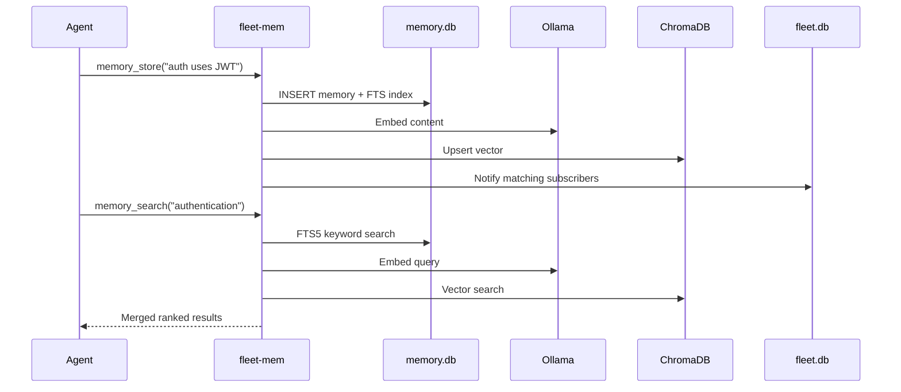
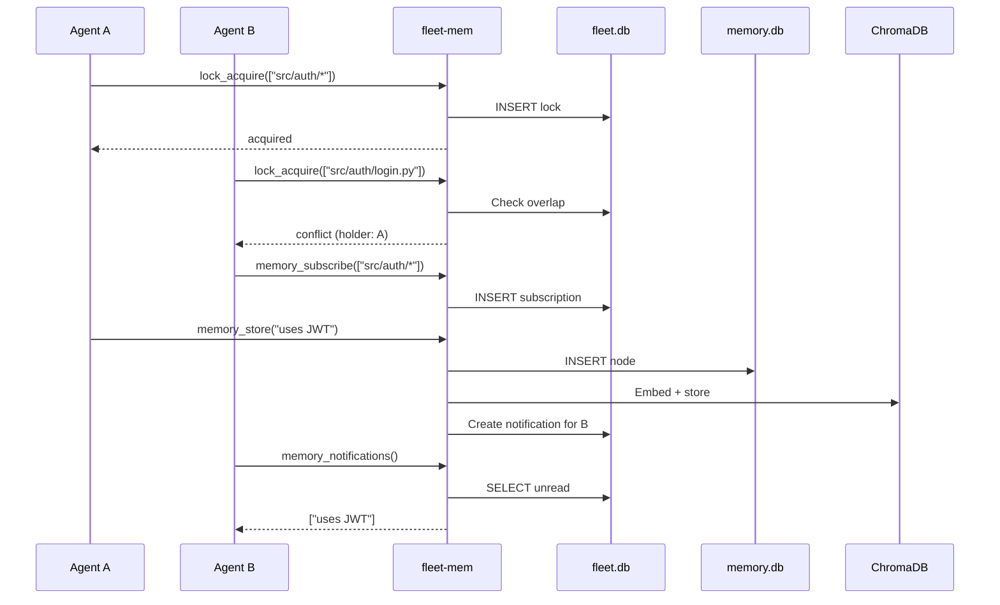
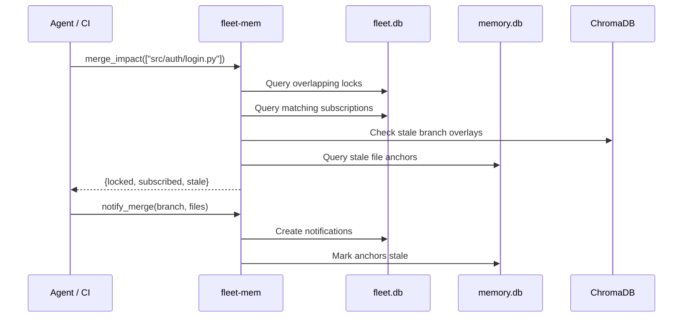

[](https://github.com/sam-ent/fleet-mem/actions/workflows/ci.yml)
[](https://opensource.org/licenses/MIT)
[](https://www.python.org/downloads/)
[](https://modelcontextprotocol.io)

# fleet-mem

Shared code intelligence for agent fleets. AST-aware semantic search, multi-agent memory, and git-concurrent coordination.

**When multiple AI agents work on the same codebase, they fight.** Agent A rewrites a function that Agent B is also modifying. Agent C searches for a pattern that Agent D already found and documented. Agents repeat work, create conflicts, and operate on stale information.

fleet-mem is a local [MCP](https://modelcontextprotocol.io) server that gives AI coding agents shared context:

- **Zero data leakage.** Runs entirely on your machine. No cloud APIs, no telemetry, no data leaves your network.
- **Token-efficient code search.** Understands the structure of your code via Abstract Syntax Trees (AST). Returns the specific function, not the entire file.
- **Fleet-aware.** Agents share discoveries, declare what files they are working on, and get notified when another agent's merge affects their context.

---

## Getting started

### Prerequisites

- Python 3.11+
- [Ollama](https://ollama.ai) running locally (brew, systemd, or Docker)
- `ollama pull nomic-embed-text`

<br>

### Install

```bash
git clone https://github.com/sam-ent/fleet-mem.git
cd fleet-mem
./scripts/setup.sh
```

<br>

### Index your codebases

```bash
./scripts/index-repos.sh --root ~/projects
```

<br>

### MCP client configuration

Add to your MCP client settings (the `setup.sh` script does this automatically for the default client):

```json
{
  "mcpServers": {
    "fleet-mem": {
      "command": "/path/to/fleet-mem/.venv/bin/python",
      "args": ["-m", "src.server"],
      "cwd": "/path/to/fleet-mem",
      "env": {
        "OLLAMA_HOST": "http://localhost:11434",
        "ANONYMIZED_TELEMETRY": "False"
      }
    }
  }
}
```

fleet-mem works with any MCP-compatible client. Your client starts it automatically on the first tool call.

<br>

### Example agent queries

Once indexed, agents can ask things they could not do with grep:

- *"Find the authentication middleware and show me how tokens are validated"*
- *"Which agent is currently working on the database schema?"*
- *"What did other agents learn about the payment gateway this session?"*
- *"If I merge this branch, which agents will have stale context?"*

---

## How it works

fleet-mem installs once as a global MCP server. It can index any number of projects. Each project gets its own collection in ChromaDB. All agents share the same server instance.

```
~/projects/
  project-a/     indexed as code_project-a
  project-b/     indexed as code_project-b
  project-c/     indexed as code_project-c

~/.local/share/fleet-mem/
  chroma/         vector embeddings (shared)
  memory.db       agent memories (shared)
  fleet.db        locks, subscriptions (shared)
```

<br>

### Architecture



<br>

### Components

| Component | What it is | Why we chose it |
|-----------|-----------|-----------------|
| **[Ollama](https://ollama.ai)** | Local ML inference server | Runs embedding models on your machine at zero cost. Supports dozens of models. Works via Docker, systemd, or brew. Swappable via the `Embedding` base class |
| **[ChromaDB](https://www.trychroma.com/)** | Vector database (HNSW) | Purpose-built for similarity search over embeddings. Runs in-process, no separate server needed |
| **SQLite + FTS5** | Relational database with full-text search | Agent memories need both keyword search and structured queries. FTS5 + ChromaDB vectors give hybrid ranking via reciprocal rank fusion |
| **[tree-sitter](https://tree-sitter.github.io/tree-sitter/)** | Incremental parsing library | Splits code into semantic chunks (functions, classes, methods) instead of arbitrary character windows. Search results are meaningful code units, not fragments |
| **[xxHash](https://xxhash.com) (xxh3_64)** | File change detection + chunk IDs | Detects which files changed between sync cycles. Not a security function, purely for diffing. ~10x faster than SHA-1 |

<br>

### Language support

| Language | Splitting method | Support level |
|----------|-----------------|---------------|
| Python, TypeScript, JavaScript | AST-aware | Tier 1: functions, classes, methods |
| Go, Rust | AST-aware | Tier 2: functions, types, impl blocks |
| All other languages | Text-only | Fallback: sliding window (2500 chars, 300 overlap) |

AST-aware splitting means search results are complete, meaningful code units. Text-only fallback still works but may return partial functions. Adding a new language requires defining its tree-sitter node types in `src/splitter/ast_splitter.py` (contributions welcome).

<br>

### Process flows

<br>

#### Indexing a codebase

> **Problem:** Agents read entire files to understand code, burning tokens and missing context across files.
> **Solution:** One-time indexing parses code into semantic chunks and embeds them. Agents search by meaning across the whole codebase.



<br>

#### Semantic code search

> **Problem:** Grep requires exact strings. Agents don't know file names or function signatures in unfamiliar code.
> **Solution:** Natural language query returns ranked code snippets with file paths and line numbers. No exact match needed.



<br>

#### Storing and searching memory

> **Problem:** Agents lose everything they learn when a session ends. The next agent re-discovers the same things from scratch.
> **Solution:** Discoveries persist in a shared memory store. Any agent can find them later via keyword or semantic search.



<br>

#### Multi-agent coordination

> **Problem:** Concurrent agents modify the same files, causing merge conflicts and duplicated effort. No one knows what anyone else is doing.
> **Solution:** Agents declare their work area, get blocked on conflicts before they start, and automatically receive discoveries from other agents working nearby.



<br>

#### Merge impact preview

> **Problem:** Agent A merges a PR. Agents B and C are still working on branches that now have stale context. No one tells them.
> **Solution:** Before merging, see exactly which agents, memories, and branches will be affected. After merging, one call notifies everyone and marks stale context.



<br>

### Embedding providers

The default is Ollama (local, free). fleet-mem also ships an OpenAI-compatible adapter that works with any provider offering an OpenAI-style embeddings API.

| Provider | Setup | Cost |
|----------|-------|------|
| **Ollama** (default) | Install Ollama, `ollama pull nomic-embed-text` | Free |
| **OpenAI** | Set `EMBEDDING_PROVIDER=openai-compat`, `EMBED_API_KEY`, `EMBED_MODEL=text-embedding-3-small` | ~$0.02/1M tokens |
| **DeepSeek** | Set `EMBED_BASE_URL=https://api.deepseek.com/v1`, `EMBED_API_KEY`, `EMBED_MODEL=deepseek-embed` | ~$0.01/1M tokens |
| **Gemini** | Set `EMBED_BASE_URL=https://generativelanguage.googleapis.com/v1beta/openai/`, `EMBED_API_KEY`, `EMBED_MODEL=text-embedding-004` | Free tier available |
| **Together** | Set `EMBED_BASE_URL=https://api.together.xyz/v1`, `EMBED_API_KEY`, model of choice | Varies |
| **Local vLLM** | Set `EMBED_BASE_URL=http://localhost:8000/v1`, no API key needed | Free |

See `.env.example` for full configuration. For providers without an OpenAI-compatible API (Cohere, AWS Bedrock, Hugging Face), see [docs/custom-embedding-providers.md](docs/custom-embedding-providers.md). The adapter interface is four methods and typically under 30 lines.

---

## Features

### Code understanding

- **Semantic search**: "find auth middleware" returns relevant functions, not string matches
- **Symbol lookup**: find function/class definitions across indexed projects
- **Dependency analysis**: trace what calls or imports a given symbol
- **Incremental sync**: xxHash Merkle tree detects file changes, re-indexes only deltas
- **Branch-aware indexing**: overlay collections for feature branches keep changes isolated from the main index

<br>

### Fleet coordination

- **File lock registry**: agents declare which files they are working on, others check before starting
- **Cross-agent memory**: agents share discoveries via subscriptions and notifications
- **Merge impact preview**: before merging, see which in-flight agents would be affected
- **Post-merge notification**: after merging, automatically notify affected agents and mark stale context

---

## Configuration

All settings via environment variables or a `.env` file in the project root. Copy `.env.example` to get started.

| Variable | Default | Description |
|----------|---------|-------------|
| `OLLAMA_HOST` | `http://localhost:11434` | Ollama API endpoint |
| `OLLAMA_EMBED_MODEL` | `nomic-embed-text` | Embedding model name |
| `EMBEDDING_PROVIDER` | `ollama` | Provider: `ollama` or `openai-compat` |
| `CHROMA_PATH` | `~/.local/share/fleet-mem/chroma` | ChromaDB storage |
| `MEMORY_DB_PATH` | `~/.local/share/fleet-mem/memory.db` | Agent memory database |
| `FLEET_DB_PATH` | `~/.local/share/fleet-mem/fleet.db` | Fleet coordination database |
| `SYNC_INTERVAL` | `300` | Background code index sync (seconds) |
| `MCP_SETTINGS_FILE` | `~/.claude/settings.json` | MCP client settings path |

<br>

### Background sync timing

| What | Timing | How |
|------|--------|-----|
| **Code index refresh** | Every `SYNC_INTERVAL` seconds (default: 300) | Polls filesystem, computes xxHash digests, re-indexes changed files |
| **Agent memory writes** | Immediate | Direct SQLite + ChromaDB insert on `memory_store` call |
| **Lock acquire/release** | Immediate | Direct SQLite write |
| **Notifications** | Immediate | Created on `memory_store` if subscriptions match |

For fast-moving multi-agent work, reduce `SYNC_INTERVAL` to `30`-`60`. A future release will add file-watching for near-instant sync.

<br>

### Scripts

| Script | Purpose |
|--------|---------|
| `scripts/setup.sh` | One-time install: venv, dependencies, Ollama check, MCP registration |
| `scripts/index-repos.sh` | Find git repos under a root directory and index each one |
| `scripts/import-flat-files.py` | Import existing memory files (markdown with YAML frontmatter) |
| `scripts/embed-existing-nodes.py` | Embed existing memory DB nodes into ChromaDB for semantic search |

---

## MCP tools reference

### Code search (6 tools)

| Tool | Parameters | Description |
|------|-----------|-------------|
| `index_codebase` | `path, branch?, force?` | Index a codebase (background). Branch-aware when `branch` specified |
| `search_code` | `query, path?, branch?, limit?` | Semantic code search across indexed projects |
| `find_symbol` | `name, file_path?, symbol_type?` | Find symbol definitions (functions, classes) |
| `find_similar_code` | `code_snippet, limit?` | Find code similar to a given snippet |
| `get_change_impact` | `file_paths?, symbol_names?` | Find code affected by changes to given files/symbols |
| `get_dependents` | `symbol_name, depth?` | Trace what calls/imports a symbol (BFS) |

<br>

### Agent memory (4 tools)

| Tool | Parameters | Description |
|------|-----------|-------------|
| `memory_store` | `node_type, content, agent_id?` | Store a memory with optional file anchor |
| `memory_search` | `query, top_k?, node_type?` | Hybrid keyword + semantic memory search |
| `memory_promote` | `memory_id, target_scope?` | Promote a project memory to global scope |
| `stale_check` | `project_path?` | Find memories whose anchored files have changed |

<br>

### Fleet coordination (8 tools)

| Tool | Parameters | Description |
|------|-----------|-------------|
| `lock_acquire` | `agent_id, project, file_patterns` | Declare files an agent is working on |
| `lock_release` | `agent_id, project` | Release file locks |
| `lock_query` | `project, file_path?` | Check who holds locks on which files |
| `merge_impact` | `project, files` | Preview which agents/memories are affected by a merge |
| `notify_merge` | `project, branch, merged_files` | Post-merge: notify affected agents, mark stale anchors |
| `memory_feed` | `agent_id?, since_minutes?` | Recent memories from other agents |
| `memory_subscribe` | `agent_id, file_patterns` | Subscribe to memories about specific files |
| `memory_notifications` | `agent_id` | Check for new relevant memories from other agents |

<br>

### Status (4 tools)

| Tool | Parameters | Description |
|------|-----------|-------------|
| `get_index_status` | `path` | Check indexing status for a project |
| `clear_index` | `path` | Drop a project's index and reset |
| `get_branches` | `path` | List indexed branches with chunk counts |
| `cleanup_branch` | `path, branch` | Drop a branch overlay after merge |

---

## What's next

- [ ] Hierarchical Merkle sync for large monorepos
- [ ] Asyncio transition for concurrent agent workloads
- [ ] Docker Compose deployment (fleet-mem + Ollama in one container)
- [ ] File-watching for near-instant sync (replace polling)
- [ ] Performance benchmarks

See [roadmap.md](roadmap.md) for the full plan.

---

## Acknowledgments

Architecture inspired by [claude-context](https://github.com/zilliztech/claude-context) by Zilliz (MIT License). Design patterns informed by their TypeScript reference (vector database abstraction, embedding adapter, Merkle DAG, AST splitter). All code is an original Python implementation with significant additions (agent memory, fleet coordination, hybrid search, staleness detection).

## License

MIT
