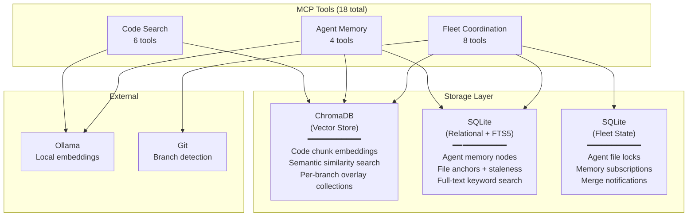

[](https://github.com/sam-ent/fleet-mem/actions/workflows/ci.yml)
[](https://opensource.org/licenses/MIT)
[](https://www.python.org/downloads/)
[](https://modelcontextprotocol.io)

# fleet-mem

Shared code intelligence for agent fleets.

fleet-mem is a local MCP server that gives AI coding agents two capabilities:

1. **Code understanding**: parse, index, and semantically search codebases using Abstract Syntax Tree (AST) splitting and vector embeddings
2. **Fleet coordination**: share knowledge across concurrent agents working on the same codebase, prevent file conflicts, and detect stale context after merges



## Why three databases?

| Database | Type | Purpose | Why this type? |
|----------|------|---------|----------------|
| **ChromaDB** | Vector store (HNSW) | Stores code chunk embeddings for semantic search. "Find code similar to X" | Vector similarity search requires specialized indexing (HNSW). SQLite can't do this efficiently |
| **SQLite (memory)** | Relational + FTS5 | Stores agent memories, file anchors, staleness tracking. Hybrid keyword + semantic search | FTS5 provides fast keyword search. Combined with ChromaDB vectors for hybrid ranking (reciprocal rank fusion) |
| **SQLite (fleet)** | Relational | Stores agent locks, memory subscriptions, merge notifications | Pure coordination state. No search needed, just fast reads/writes with transactions |

## Features

### Code understanding

- **Semantic search**: index codebases with tree-sitter Abstract Syntax Tree (AST) splitting, search by meaning via vector similarity
- **Symbol lookup**: find function/class definitions across indexed projects
- **Dependency analysis**: trace what calls or imports a given symbol
- **Incremental sync**: SHA-1 Merkle tree detects file changes, re-indexes only deltas

### Fleet coordination

- **Branch-aware indexing**: overlay collections for feature branches so agents see their own changes without polluting the base index
- **File lock registry**: agents declare which files they're working on, others check before starting to avoid merge conflicts
- **Cross-agent memory**: agents share discoveries via subscriptions and notifications. Agent A finds a bug in auth code, Agent B (working on auth) gets notified
- **Merge impact preview**: before merging, see which in-flight agents would be affected. After merging, notify them automatically

## Getting started

### Prerequisites

- Python 3.11+
- [Ollama](https://ollama.ai) running locally (any install method: brew, systemd, Docker)
- The `nomic-embed-text` model pulled in Ollama

### Setup

```bash
# 1. Install: creates venv, installs deps, registers MCP server
./scripts/setup.sh

# 2. Index your codebases
./scripts/index-repos.sh --root ~/projects
```

### Scripts

| Script | Purpose |
|--------|---------|
| `scripts/setup.sh` | One-time install: venv, dependencies, Ollama connectivity check, MCP server registration |
| `scripts/index-repos.sh` | Walks a directory for git repos and indexes each one into ChromaDB |
| `scripts/import-flat-files.py` | Import existing memory files (markdown with YAML frontmatter) into the memory database |
| `scripts/embed-existing-nodes.py` | Embed existing memory database nodes into ChromaDB for semantic search |

## Configuration

All settings via environment variables or a `.env` file in the project root. Copy `.env.example` to get started.

| Variable | Default | Description |
|----------|---------|-------------|
| `CHROMA_PATH` | `~/.local/share/fleet-mem/chroma` | ChromaDB persistent storage |
| `OLLAMA_HOST` | `http://localhost:11434` | Ollama API endpoint |
| `OLLAMA_EMBED_MODEL` | `nomic-embed-text` | Embedding model name |
| `MEMORY_DB_PATH` | `~/.local/share/fleet-mem/memory.db` | Agent memory database |
| `FLEET_DB_PATH` | `~/.local/share/fleet-mem/fleet.db` | Fleet coordination database (locks, subscriptions) |
| `SYNC_INTERVAL` | `300` | Background sync interval in seconds |

## MCP tools reference

### Code search tools

| Tool | Parameters | Description |
|------|-----------|-------------|
| `index_codebase` | `path, branch?, force?` | Index a codebase (background). Branch-aware when `branch` specified |
| `search_code` | `query, path?, branch?, limit?` | Semantic code search across indexed projects |
| `find_symbol` | `name, file_path?, symbol_type?` | Find symbol definitions (functions, classes) |
| `find_similar_code` | `code_snippet, limit?` | Find code similar to a given snippet |
| `get_change_impact` | `file_paths?, symbol_names?` | Find code affected by changes to given files/symbols |
| `get_dependents` | `symbol_name, depth?` | Trace what calls/imports a symbol (BFS) |

### Memory tools

| Tool | Parameters | Description |
|------|-----------|-------------|
| `memory_store` | `node_type, content, agent_id?` | Store a memory with optional file anchor |
| `memory_search` | `query, top_k?, node_type?` | Hybrid keyword + semantic memory search |
| `memory_promote` | `memory_id, target_scope?` | Promote a project memory to global scope |
| `stale_check` | `project_path?` | Find memories whose anchored files have changed |

### Fleet coordination tools

| Tool | Parameters | Description |
|------|-----------|-------------|
| `lock_acquire` | `agent_id, project, file_patterns` | Declare files an agent is working on |
| `lock_release` | `agent_id, project` | Release file locks |
| `lock_query` | `project, file_path?` | Check who holds locks on which files |
| `merge_impact` | `project, files` | Preview which agents/memories are affected by a merge |
| `notify_merge` | `project, branch, merged_files` | Post-merge: notify affected agents, mark stale anchors |
| `memory_feed` | `agent_id?, since_minutes?` | Recent memories from other agents |
| `memory_subscribe` | `agent_id, file_patterns` | Subscribe to memories about specific files |
| `memory_notifications` | `agent_id` | Check for new relevant memories from other agents |

### Status tools

| Tool | Parameters | Description |
|------|-----------|-------------|
| `get_index_status` | `path` | Check indexing status for a project |
| `clear_index` | `path` | Drop a project's index and reset |
| `get_branches` | `path` | List indexed branches with chunk counts |
| `cleanup_branch` | `path, branch` | Drop a branch overlay after merge |

## Acknowledgments

Architecture inspired by [claude-context](https://github.com/zilliztech/claude-context) by Zilliz (MIT License). The following design patterns were informed by their TypeScript reference:

- Vector database abstraction with collection-based storage
- Embedding adapter with auto-dimension detection and batch chunking
- Merkle DAG for file change detection with snapshot comparison
- File synchronizer with JSON snapshot persistence
- AST splitter with per-language tree-sitter node-type tables

All code is an original Python implementation with significant additions (agent memory, fleet coordination, hybrid search, staleness detection).

## License

MIT
